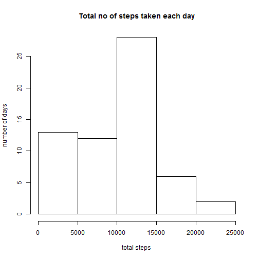
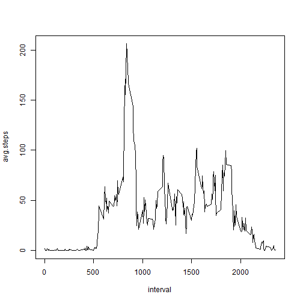
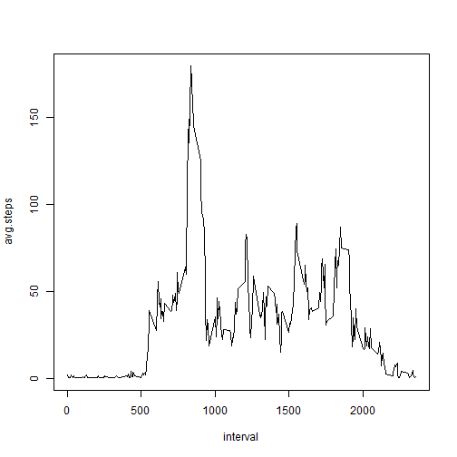
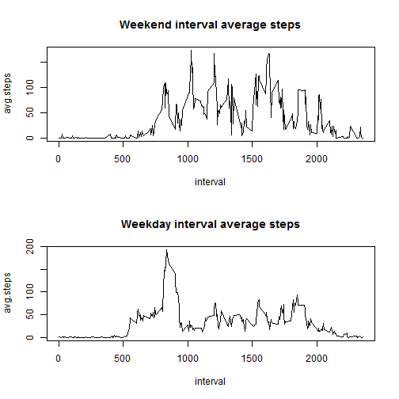

## Loading and preprocessing the data


```r
unzip ("Activity.zip")
myActivity <- read.csv("Activity.csv")
```
  
 

## What is mean total number of steps taken per day?

```r
d2d <- aggregate(myActivity$steps, by = list(myActivity$date), FUN = sum, na.rm=TRUE)
names(d2d)= c("date","total")
hist(d2d$total, main="Total no of steps taken each day", xlab="total steps", ylab="number of days" )
```

 

```r
dev.copy(png,'Each_Day_Step_Histogram.png')
```

```
## png 
##  13
```

```r
##Mean Total Steps taken a day
print(mean(d2d$total))
```

```
## [1] 9354.23
```

```r
##[1] 9354.23
##Median total steps taken a day
print(median(d2d$total))
```

```
## [1] 10395
```

```r
##[1] 10395
```


## What is the average daily activity pattern?

```r
t2t <- aggregate(myActivity$steps, by = list(myActivity$interval), FUN = mean, na.rm=TRUE)
names(t2t)=c("interval","avg.steps")
plot(t2t, type="l")
```

 

```r
dev.copy(png,'AverageDailyActivity.png')
```

```
## png 
##  14
```

```r
##Which 5-minute interval, on average across all the days in the dataset, contains the maximum number of steps?
t2t$interval[t2t$avg.steps == max(t2t$avg.steps)]
```

```
## [1] 835
```

```r
##[1] 835
```

## Imputing missing values

##numbers of NA's in data


```r
sum(is.na(myActivity$steps))
```

```
## [1] 2304
```

```r
##[1] 2304
```

#code for replacing missing value with time interval average.


```r
for(i in 1:nrow(myActivity)){
     if(is.na(myActivity$steps[i])){
          myActivity$steps[i]<- t2t$avg.steps[t2t$interval == myActivity$interval]
   }
}

d2d <- aggregate(myActivity$steps, by = list(myActivity$date), FUN = sum, na.rm=TRUE)
names(d2d)= c("date","total")
hist(d2d$total, main="Total no of steps taken each day", xlab="total steps", ylab="number of days" )
```

 

```r
dev.copy(png,'Modified_Each_Day_Step_Histogram.png')
```

```
## png 
##  15
```

```r
##Mean Total Steps taken a day
print(mean(d2d$total))
```

```
## [1] 9419.081
```

```r
##[1] 9419.081
##Median total staken a day
print(median(d2d$total))
```

```
## [1] 10395
```

```r
##[1] 10395
```

```r
t2t <- aggregate(myActivity$steps, by = list(myActivity$interval), FUN = mean, na.rm=TRUE)
names(t2t)=c("interval","avg.steps")

plot(t2t, type="l")
```

 

```r
dev.copy(png,'ModifiedAverageDailyActivity.png')
```

```
## png 
##  16
```

```r
##Which 5-minute interval, on average across all the days in the dataset, contains the maximum number of steps?
t2t$interval[t2t$avg.steps == max(t2t$avg.steps)]
```

```
## [1] 835
```

```r
##[1] 835
```


## Are there differences in activity patterns between weekdays and weekends?


```r
myActivity$date <-  as.Date(myActivity$date)
myActivity$wkD <- factor((weekdays(myActivity$date)%in% c("Saterday","Sunday")),levels = c(TRUE,FALSE), labels = c("weekend","weekday"))
##summary(myActivity$wkD)

WK <- split(myActivity, myActivity$wkD)


par(mfrow = c(2,1))


wkndt2t <- aggregate(WK[["weekend"]]$steps, by = list(WK[["weekend"]]$interval), FUN = mean, na.rm=TRUE)
names(wkndt2t )=c("interval","avg.steps")
plot(wkndt2t , type="l", main = "Weekend interval average steps")


wkdyt2t <- aggregate(WK[["weekday"]]$steps, by = list(WK[["weekday"]]$interval), FUN = mean, na.rm=TRUE)
names(wkdyt2t )=c("interval","avg.steps")
plot(wkdyt2t , type="l", main = "Weekday interval average steps")
```

 

```r
dev.copy(png,'PanelPlot_AverageDailyActivity.png')
```

```
## png 
##  17
```


